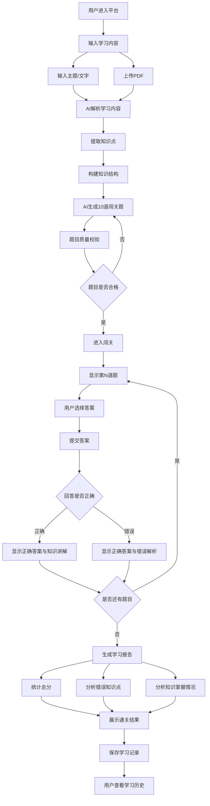
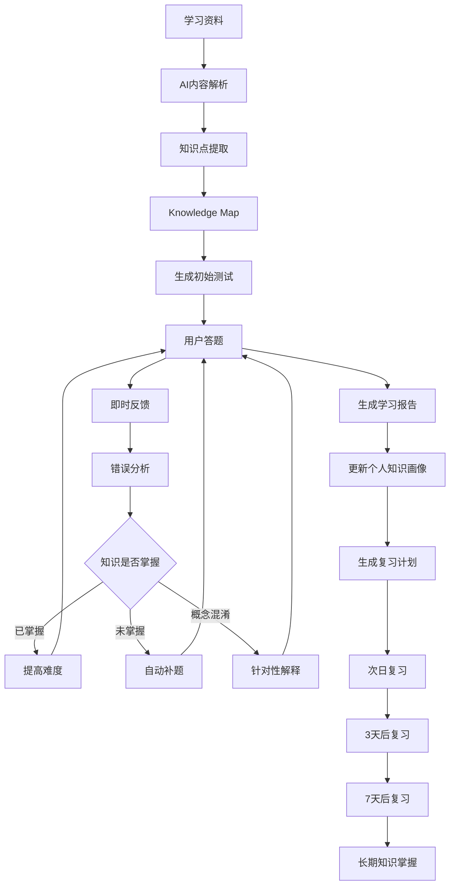

# AI交互式知识闯关学习平台
## 需求分析文档

**文档版本：V1.0**  
**调研时间：2026年9月14日**  
**文档用途：产品立项 / MVP开发 / 后续功能规划**

---

# 一、需求背景

## 1.1 项目背景

随着生成式 AI、大语言模型和 RAG 技术的发展，AI 已经可以从文本、PDF、网页、视频等学习材料中提取知识，并自动生成题目、答案和解析。

目前市场上已经出现了较多类似产品，例如 QuizFlex、Quizgecko、StudyGlen、Quizlet、Kahoot、Coursebox、Jotform AI Quiz Generator 等，说明：

> **“学习资料 → AI自动生成测验”已经被市场验证是一类真实需求。**

但与此同时，单纯的“AI自动出题”竞争已经比较激烈，因此本项目不能仅仅做成一个“上传资料然后生成10道题”的工具。两份需求分析都指出，真正值得深挖的是从“生成题目”进一步发展成完整的学习闭环。

---

## 1.2 用户痛点

当前用户在学习过程中主要存在以下问题：

### 痛点一：学习过程比较被动

用户经常采用：

> 看文章 → 看视频 → 看课件 → 看完觉得自己“会了”

但真正答题时才发现：

> “好像看懂了，但实际上没有掌握。”

---

### 痛点二：自己整理题目成本高

学生或自学者往往需要：

- 自己整理知识点
- 自己寻找重点
- 自己出题
- 自己整理答案
- 自己总结错题

整个过程耗时较长。

---

### 痛点三：传统题库比较固定

传统题库通常是：

> 固定题目 → 固定答案 → 固定顺序

无法根据用户的具体答题情况及时变化。

---

### 痛点四：缺少即时反馈

用户答错之后，如果不能立即知道：

- 为什么错
- 正确答案是什么
- 哪个知识点没有掌握
- 错在概念还是应用

那么一次错误很容易被重复犯。

---

### 痛点五：学习结束后缺少复盘

很多学习工具只能告诉用户：

> “你得了80分。”

但用户真正需要知道的是：

> 我哪里不会？  
> 我为什么错？  
> 哪些知识最薄弱？  
> 下一步应该复习什么？

---

## 1.3 产品机会

因此，本项目不应该单纯定位为：

> AI出题工具

而应该定位为：

> **AI个人学习闯关助手**

长期可以进一步升级为：

> **AI Personal Learning Engine / AI个人学习引擎**

核心理念：

> **把用户想学的任何内容，转化成一场可以互动、答题、纠错和复盘的 AI 学习闯关。**

第一份需求文档进一步提出了一个非常重要的产品思想：

> **Learning Loop：内容 → 理解 → 提问 → 作答 → 诊断 → 补救 → 再测试 → 复习。**

这应该成为后续产品的核心方向。

---

# 二、MVP最小可行功能点

## 2.1 MVP设计原则

前期产品必须遵守：

> **少做功能，只做完整闭环。**

第一版不要同时开发：

- 社交
- PK
- 排行榜
- 数字人
- AI生图
- 企业后台
- 复杂知识库
- 多种题型
- 全网复杂搜索
- 多端 App

否则产品开发周期会迅速失控。

原需求中已经明确建议 MVP 收缩为文本、PDF、URL、YouTube 等内容输入，并暂时不做复杂全网搜索和超大型知识库。

---

# 2.2 MVP核心目标

第一版只验证一个问题：

> **用户是否愿意把自己的学习资料交给 AI，然后通过“闯关答题”的方式完成学习，并愿意再次回来学习。**

因此第一版必须形成下面这个完整闭环：

> **输入 → 生成 → 答题 → 反馈 → 报告**

---

# 2.3 MVP功能一：学习内容输入

### 功能目标

允许用户输入自己想学习的内容。

### 第一版建议支持

**P0：**

- 直接输入主题
- 输入文字
- 上传 PDF

为了降低第一版开发复杂度，建议：

> **V0先支持“文字/主题 + PDF”。**

URL、YouTube 可以在 V1 增加。

### 页面示例

```text
你今天想学什么？

[ 输入你想学习的知识 ]

例如：
Redis缓存机制
Java集合框架
计算机网络TCP/IP
Spring Boot自动配置

或者：

[ 上传 PDF ]
```

---

# 2.4 MVP功能二：AI知识解析

AI接收到学习内容后：

1. 提取主要知识点
2. 提取关键概念
3. 提取定义
4. 提取重要关系
5. 判断重点内容
6. 准备生成题目所需要的知识上下文

最终形成内部结构化知识。

例如：

```text
Redis
├── 基本概念
├── 数据类型
├── 持久化
├── 缓存
│   ├── 缓存穿透
│   ├── 缓存击穿
│   └── 缓存雪崩
└── 集群
```

---

# 2.5 MVP功能三：AI自动生成闯关题目

系统根据用户输入内容自动生成一组题目。

### 第一版建议：

每次生成：

> **5道题**

### 第一版只做三种题型：

1. 单选题
2. 判断题
3. 场景题

不建议第一版加入：

- 填空题
- 匹配题
- 简答题
- 主观题
- 复杂题型

原因：

> 第一版最重要的不是题型数量，而是体验是否顺畅。

---

## 2.5.1 题目结构

每一道题包含：

```text
题目
选项
正确答案
答案解析
对应知识点
题目难度
资料来源
```

---

# 2.6 MVP功能四：交互式答题闯关

用户逐题完成答题。

界面显示：

```text
第3 / 5题

Redis缓存击穿通常发生在哪一种情况下？

A. ...
B. ...
C. ...
D. ...

[提交答案]
```

页面顶部显示：

> 当前进度：3 / 5

---

# 2.7 MVP功能五：即时答题反馈

用户每完成一道题后，立即显示结果。

### 正确

```text
✓ 回答正确

正确答案：B

知识解析：

......

对应知识点：
Redis缓存击穿
```

### 错误

```text
✕ 回答错误

你的答案：C
正确答案：B

为什么错？

......

知识点：
Redis缓存击穿
```

这一功能是 MVP 中非常重要的一环。

因为产品真正想做的不是：

> “让用户考试”

而是：

> **“让用户通过答题完成学习。”**

---

# 2.8 MVP功能六：通关总结

用户完成5道题之后生成学习报告。

报告至少包含：

### 学习结果

- 总分
- 正确率
- 完成时间

### 知识掌握情况

- 掌握较好
- 一般
- 薄弱

### 错题分析

- 错误题目
- 错误知识点

### 学习建议

例如：

```text
你当前对 Redis 基础概念掌握较好。

但是：
“缓存击穿”和“缓存穿透”容易混淆。

建议继续复习：

1. 缓存穿透
2. 缓存击穿
3. 缓存雪崩
```

---

# 2.9 MVP功能七：学习记录

后台记录：

- 学习主题
- 学习时间
- 题目数量
- 正确率
- 错题
- 知识点

这样用户可以看到：

```text
我的学习

Redis             82%
Java集合          76%
Spring Boot       91%
计算机网络        68%
```

第一版不需要做复杂的数据分析，只需要：

> **保存 + 查看学习历史。**

---

# 2.10 MVP最终功能范围

因此，第一版最终收敛为：

| 功能 | 是否MVP |
|---|---|
| 输入主题/文字 | ✅ |
| PDF上传 | ✅ |
| AI解析 | ✅ |
| AI生成题目 | ✅ |
| 单选题 | ✅ |
| 判断题 | ✅ |
| 场景题 | ✅ |
| 在线答题 | ✅ |
| 即时答案 | ✅ |
| 即时解析 | ✅ |
| 错题记录 | ✅ |
| 通关报告 | ✅ |
| 学习历史 | ✅ |
| 基础知识分析 | ✅ |
| URL输入 | ❌ |
| YouTube解析 | ❌ |
| RAG知识库 | ❌ |
| AI生图 | ❌ |
| PK | ❌ |
| 排行榜 | ❌ |
| 数字人 | ❌ |
| 语音 | ❌ |
| 企业后台 | ❌ |

---

# 三、后续可以做的扩展功能点

后续功能按照：

> **用户价值 × 实现难度 × 产品差异化 × 商业潜力**

进行优先级划分。

---

# 3.1 P0：强烈推荐优先做

这些功能直接决定产品是否能够从普通 AI 出题工具升级成 AI 学习产品。

---

## P0-1：错题自动追问

用户答错以后，AI不只是告诉用户正确答案，而是继续追问。

例如：

```text
你刚才把“缓存击穿”和“缓存穿透”混淆了。

那么：

如果数据库中本身不存在这个数据，但是大量请求不断访问它，
这属于什么问题？

A. 缓存击穿
B. 缓存穿透
C. 缓存雪崩
```

价值：

> **让错误本身成为新的学习机会。**

这是非常值得作为核心差异化的功能。

---

## P0-2：AI动态难度

根据用户表现动态调整题目。

例如：

```text
基础题 → 概念题 → 对比题 → 应用题 → 场景题
```

而不是简单的：

```text
简单 → 中等 → 困难
```

系统真正关注的是：

> 用户对某一个知识点掌握到什么程度。

第一份需求文档把“自适应难度”列为最高优先级差异化能力之一。

---

## P0-3：知识薄弱点诊断

系统不仅记录：

> 正确率60%

而进一步判断：

- 没学会
- 概念混淆
- 不会应用
- 记忆不牢
- 容易粗心

最终形成：

> **个人知识薄弱画像**

---

## P0-4：间隔复习

根据历史答题情况安排复习。

例如：

```text
今天：
完成学习

明天：
复习5题

3天后：
再次复习

7天后：
再次挑战
```

这是“Learning Loop”从一次性闯关升级到持续学习的重要功能。

---

## P0-5：Knowledge Map

例如：

```text
Redis                    72%

├── 数据类型              92%
├── 持久化                83%
├── 集群                  71%
└── 缓存                  58%
    ├── 穿透              48%
    ├── 击穿              43%
    └── 雪崩              68%
```

用户可以非常直观地知道：

> **自己到底哪里不会。**

---

# 3.2 P1：有价值，第二阶段开发

---

## P1-1：URL学习

用户直接粘贴：

```text
https://...
```

系统：

> 抓取网页 → 提取正文 → AI分析 → 生成闯关。

---

## P1-2：YouTube / 视频学习

输入视频：

> 获取字幕 → 提取知识 → 生成题目。

原需求和竞品调研都已经验证这种技术路线是可实现的。

---

## P1-3：Boss Challenge

完成一组基础题后：

> 最终Boss挑战。

例如学习 Redis：

```text
普通题：

Redis有哪些数据类型？

Boss：

一个高并发秒杀系统出现缓存击穿，
你应该怎么解决？
```

核心作用：

> 验证用户是否真正具备“综合应用能力”。

---

## P1-4：学习任务卡

例如：

```text
今日任务

学习：
Redis缓存

预计时间：
10分钟

任务：

□ 学习基础概念
□ 完成5题
□ 完成Boss挑战
□ 复习错题
```

增加游戏化和任务感。

---

## P1-5：AI学习模式

允许用户选择目标：

```text
理解
记忆
考试
面试
速记
```

AI根据目标改变出题策略。

---

# 3.3 P1-P2：AI生图

根据知识类型自动生成：

- 示意图
- 地图
- 解剖图
- 流程图
- 单词图片

特别适合：

> 英语、医学、地理、历史等视觉知识。

不过它不是第一阶段的核心竞争力，因为竞品已经开始提供类似能力。

---

# 3.4 P2：社交与游戏化

### 多人PK

> 两个人同时答题。

### 排行榜

> 今日学习榜  
> 周榜  
> 好友榜

### 分享挑战

例如：

> 我刚完成“Java面试挑战”，得分92。

好友：

> 挑战一下？

---

# 3.5 P2：AI面试官

这个方向非常值得后续重点验证。

例如：

```text
学习内容：
Spring Boot
```

AI：

> 现在开始模拟面试。

然后：

```text
什么是Spring Boot自动配置？

为什么Spring Boot能够做到约定大于配置？

Bean生命周期是什么？

如果发生循环依赖应该怎么处理？
```

用户用自然语言回答。

AI评分：

```text
知识准确度：82%
表达能力：76%
理解深度：71%
```

它可以把：

> Quiz

进一步升级成：

> **AI Learning Interviewer**

---

# 3.6 P2：RAG个人知识库

用户上传：

- 多个PDF
- PPT
- 文档
- 教材
- 课程

系统构建：

> **个人知识库**

之后可以：

> 针对整个知识库生成题目。

---

# 3.7 P2：企业知识库

后续商业化方向：

```text
企业上传：

SOP
制度
产品文档
培训资料
技术文档

↓

AI自动生成：

培训
题库
考试
知识测评
员工能力画像
```

可以发展为：

> AI企业知识测评平台

不过不建议第一阶段开发。第一份分析也明确建议不要第一天就做企业版本。

---

# 3.8 P3：语音

包括：

- AI语音读题
- 用户语音作答
- AI语音讲解
- 英语口语练习

---

# 3.9 P3：数字人

通过虚拟人物：

> 出题 → 讲解 → 鼓励 → 互动

它属于体验增强功能，不是核心产品能力。

---

# 四、用户操作具体流程图

下面这份 Mermaid 可以直接复制到 Mermaid Live Editor、Typora、Obsidian、GitHub 等支持 Mermaid 的环境中。



---

# 五、未来完整学习闭环流程

MVP完成之后，可以逐步进化为：



这条链路才是未来真正的产品核心。

---

# 六、需求功能核对清单

以下采用 Task Checklist 形式，后续可以直接复制到 GitHub Issues、Notion、Trello、Linear 等工具中。

---

# 6.1 MVP基础框架

- [ ] 创建前端项目
- [ ] 创建后端项目
- [ ] 配置数据库
- [ ] 配置AI模型接口
- [ ] 配置文件上传能力
- [ ] 完成基础用户系统
- [ ] 完成项目基础页面框架

---

# 6.2 学习内容输入

- [ ] 实现主题输入
- [ ] 实现文字输入
- [ ] 实现PDF上传
- [ ] PDF文本解析
- [ ] PDF异常处理
- [ ] 文件大小限制
- [ ] 文件格式校验

---

# 6.3 AI知识解析

- [ ] 编写知识解析Prompt
- [ ] 提取知识点
- [ ] 提取核心概念
- [ ] 提取定义
- [ ] 提取知识关系
- [ ] 识别重点知识
- [ ] 构建内部知识结构
- [ ] 保存知识结构

---

# 6.4 AI题目生成

- [ ] 单选题生成
- [ ] 判断题生成
- [ ] 场景题生成
- [ ] 正确答案生成
- [ ] 干扰项生成
- [ ] 答案解析生成
- [ ] 知识点关联
- [ ] 题目难度标记

---

# 6.5 题目质量验证

- [ ] 检查答案是否唯一
- [ ] 检查选项是否合理
- [ ] 检查题目是否存在歧义
- [ ] 检查题目是否来自学习资料
- [ ] 检查答案与解析是否一致
- [ ] 不合格题目自动重新生成

---

# 6.6 闯关答题

- [ ] 创建闯关页面
- [ ] 展示题目
- [ ] 展示选项
- [ ] 用户选择答案
- [ ] 提交答案
- [ ] 显示答题进度
- [ ] 防止重复提交
- [ ] 自动进入下一题
- [ ] 保存用户答题记录

---

# 6.7 即时反馈

- [ ] 正确状态展示
- [ ] 错误状态展示
- [ ] 显示正确答案
- [ ] 显示答案解析
- [ ] 显示对应知识点
- [ ] 记录错题
- [ ] 支持重新查看解析

---

# 6.8 学习报告

- [ ] 统计总分
- [ ] 统计正确率
- [ ] 统计答题时间
- [ ] 统计错误题目
- [ ] 统计错误知识点
- [ ] 识别薄弱知识点
- [ ] 生成学习总结
- [ ] 生成学习建议
- [ ] 保存学习报告

---

# 6.9 学习历史

- [ ] 保存学习记录
- [ ] 展示学习列表
- [ ] 查看历史报告
- [ ] 查看历史错题
- [ ] 查看历史知识点

---

# 6.10 用户基础体验

- [ ] 首页
- [ ] 学习内容输入页
- [ ] 学习生成等待页
- [ ] 闯关页
- [ ] 答案反馈页
- [ ] 通关页
- [ ] 学习历史页
- [ ] 基础用户中心

---

# 6.11 第二阶段功能

- [ ] URL解析
- [ ] YouTube解析
- [ ] 错题自动追问
- [ ] AI动态难度
- [ ] AI薄弱点诊断
- [ ] Knowledge Map
- [ ] 间隔复习
- [ ] 学习任务卡
- [ ] Boss Challenge

---

# 6.12 第三阶段功能

- [ ] AI生成图片
- [ ] 视频上传
- [ ] 多知识源融合
- [ ] 个人RAG知识库
- [ ] AI面试官
- [ ] 模拟考试
- [ ] 场景化学习

---

# 6.13 第四阶段功能

- [ ] 好友系统
- [ ] 多人PK
- [ ] 排行榜
- [ ] 分享挑战
- [ ] 社交传播
- [ ] 社区
- [ ] 题库模板市场

---

# 6.14 商业化功能

- [ ] 免费用户额度
- [ ] VIP会员
- [ ] AI生成额度
- [ ] 积分系统
- [ ] 订阅支付
- [ ] 充值系统
- [ ] VIP权限控制
- [ ] 用量统计
- [ ] 成本统计

---

# 6.15 企业版本

- [ ] 企业账号
- [ ] 企业知识库
- [ ] RAG
- [ ] 企业题库
- [ ] 企业考试
- [ ] 员工学习记录
- [ ] 员工能力分析
- [ ] 企业管理后台
- [ ] 权限体系

---

# 七、最终MVP验收标准

第一版不要以：

> “做了多少功能”

作为完成标准。

而应该以：

> **“完整学习闭环是否可以跑通”**

作为验收标准。

---

## MVP必须做到：

### 1

用户输入：

> Redis缓存

↓

### 2

AI生成知识结构

↓

### 3

生成10道题

↓

### 4

用户逐题答题

↓

### 5

每道题立即显示：

> 正确答案 + 解析 + 知识点

↓

### 6

最后生成：

> 分数 + 正确率 + 错题 + 薄弱知识点 + 学习总结

↓

### 7

保存本次学习记录

↓

### 8

用户可以再次打开历史学习记录

---

# 八、MVP明确不做什么

为了保证第一版能够快速完成，明确砍掉：

- [x] 多人PK
- [x] 排行榜
- [x] 数字人
- [x] 语音
- [x] AI生图
- [x] 企业管理后台
- [x] 复杂RAG
- [ ] 全网深度搜索
- [x] 视频上传
- [x] App
- [x] 社区
- [x] 题库市场
- [x] 十几种题型
- [x] 复杂社交体系

第一份需求文档同样明确建议 MVP 阶段不要做这些高复杂度能力。

---

# 九、最终产品优先级

整个项目建议按照以下顺序开发：

```text
第一阶段
│
├── 输入学习内容
├── AI解析
├── AI出题
├── 闯关
├── 即时解析
└── 学习报告

↓

第二阶段
│
├── 错题追问
├── 动态难度
├── Knowledge Map
└── 间隔复习

↓

第三阶段
│
├── URL
├── YouTube
├── AI面试官
├── Boss Challenge
└── AI生图

↓

第四阶段
│
├── PK
├── 排行榜
├── 分享挑战
└── 社区

↓

第五阶段
│
├── 个人RAG
├── 企业知识库
├── 企业培训
└── 企业能力分析
```

---

# 十、最终产品定位

最终建议统一为：

> # AI个人学习闯关助手

一句话描述：

> **把你想学的任何内容，变成一场会根据你的表现不断变化的 AI 闯关。**

长期产品方向：

> **AI个人学习引擎**

真正的核心不是：

> AI能不能出题。

而是：

> **AI能不能持续发现用户不会什么，并通过提问、解释、补题和复习，让用户最终真正掌握。**

